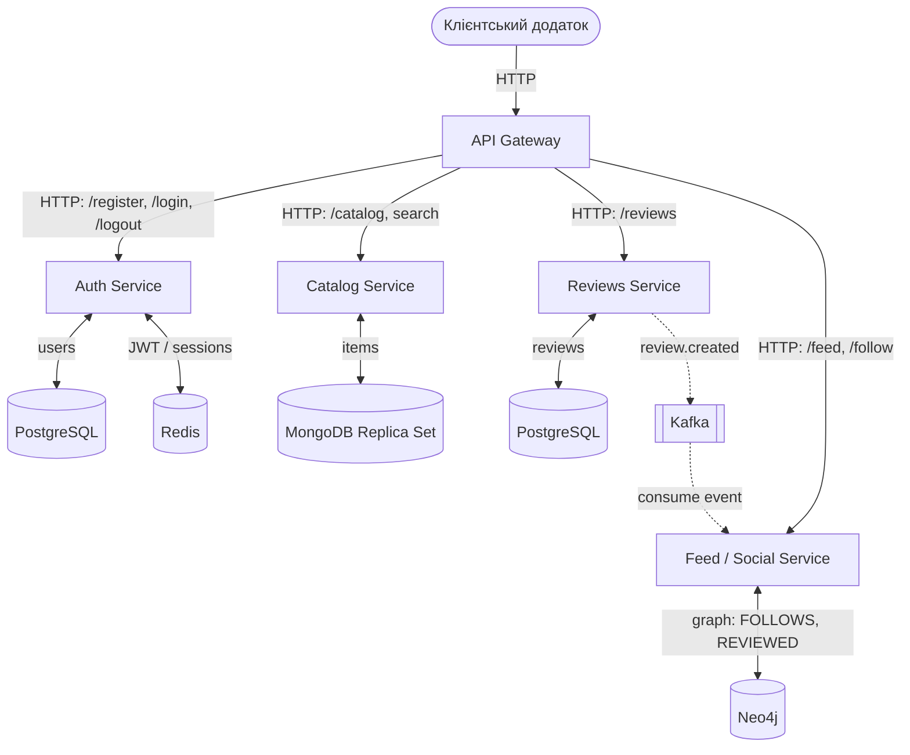

**Платформа рецензій на фільми.**

користувачі можуть реєструватися, переглядати каталог, залишати рецензії та бачити стрічку активності

**API Gateway**
Тут:
* єдина точка входу для клієнтських додатків
* маршрутизує всі вхідні HTTP-виклики до відповідних мікросервісів (Auth, Catalog, Reviews, Feed)

**Auth Service (FastAPI + PostgreSQL + Redis)**
Тут:
* реєстрація (POST /register), зберігає email + bcrypt-хеш пароля у PostgreSQL
* логін (POST /login), перевіряє пароль, генерує JWT, зберігає токен або його ідентифікатор у Redis з TTL
* логаут (POST /logout), видаляє токен з Redis
* верифікація токена (GET /verify), перевіряє валідність JWT і наявність токена y Redis
Відмовостійкість: два інстанси сервісу + Redis як спільне сховище токенів/сесій. Якщо один інстанс падає, другий продовжує працювати, бо стан користувача не зберігається локально в пам'яті сервісу.
БД схема -> users: id, email, password_hash, username, created_at

**Catalog Service (FastAPI + MongoDB Replica Set, 3 ноди)**
Тут:
* CRUD для елементів каталогу
* пошук за назвою, жанром, роком
* деталі: опис, постер, жанри, автор/режисер
MongoDB Replica Set: 3 ноди (1 primary + 2 secondary). У випадку втрати кворуму запис стає недоступним.
Приклад документа: items: id, title, description, genres, year, director, poster_url

**Reviews Service (FastAPI + PostgreSQL + Kafka producer)**
Тут:
* додати рецензію (POST /reviews) - текст + оцінка 1-10
* отримати рецензії по item (GET /reviews/{item_id})
* отримати рецензії користувача (GET /reviews/user/{user_id})
* після створення рецензії сервіс публікує подію в Kafka: review.created
Цей сервіс відповідає за асинхронну частину системи: після запису в БД він не оновлює стрічку сам, а лише відправляє подію в message queue.
БД схема -> reviews: id, user_id, item_id, text, rating, created_at

**Feed / Social Service (FastAPI + Neo4j + Kafka consumer)**
Тут:
* підписатися на користувача (POST /follow/{user_id})
* отримати стрічку активності (GET /feed) останні рецензії користувачів, на яких підписаний
* отримати very basic рекомендації наприклад, знайти користувачів із подібними оцінками або спільними item у графі
Async через Kafka: сервіс слухає топік review.created. Коли приходить подія про нову рецензію, Feed Service записує зв'язок у Neo4j або оновлює дані, потрібні для побудови стрічки. Таким чином Reviews Service не чекає відповіді від Feed Service.
Граф у Neo4j:
* (User)-[:FOLLOWS]->(User)
* (User)-[:REVIEWED]->(Item)

Усі сервіси 3-рівневі:
* API layer
* Service layer
* Repository layer

---

### Схема взаємодії мікросервісів та баз даних

